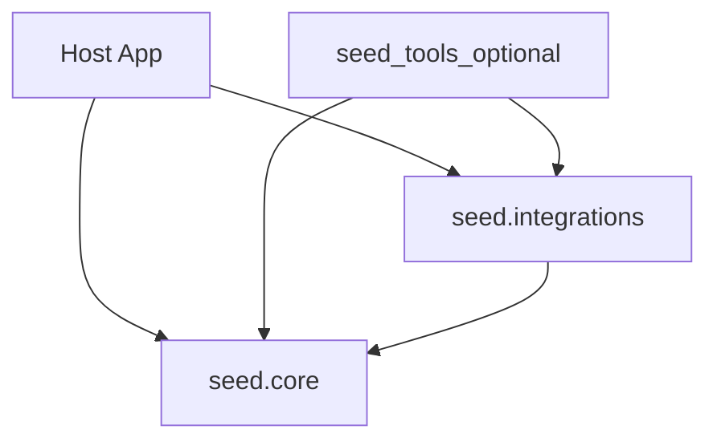

# 将 Seed 集成进宿主应用

本文说明从「宿主应用」到 **`seed.core`** / **`seed.integrations`** 的依赖方向与配置入口。**Seed 不依赖任何宿主产品包**；宿主在自身工程中声明对 `seed` / `seed-tools` 的依赖即可。可与仓库根的 [PUBLIC_API.md](../../PUBLIC_API.md) 对照阅读。

## 分层关系

1. **只做编排**：在宿主侧组合 `TurnLoopEngine`、`seed.core.tool_runtime`，按需调用 `seed_tools.setup_builtin_tools()`（需单独安装 `seed-tools`）。工作区根目录由 **`seed.core.config_plane.project_root()`** 解析，读取 **`SEED_PROJECT_ROOT`**。
2. **需要浏览器自动化、Webhook 去重、Cron、会话标题等**：再依赖 **`seed.integrations`**（可能引入额外系统依赖或可选包）。

## 配置从哪里来（优先级）

建议宿主遵守下列顺序（高层约定；具体模块若支持构造函数传参，则以显式参数为准）：

1. **构造函数 / 显式参数**（若 API 提供）。
2. **磁盘预设**：例如 `<project_root>/config/seed.models.json`、`seed.env`（由宿主或 `apply_seed_env_from_config` 加载）。
3. **进程环境变量**：统一经 **`seed.core.env_access`** 读取 `SEED_*` 变量。

详细变量表见同目录下的 [ENV_REFERENCE.md](ENV_REFERENCE.md)。

## 最小集成检查清单

| 问题 | 做法 |
|------|------|
| 装什么包？ | `pip install seed`；需要内置工具时再装 `seed-tools`（依赖 `seed`）。 |
| 项目根在哪配？ | 设置 **`SEED_PROJECT_ROOT`**，或确保默认探测逻辑符合你的部署布局。 |
| LLM 网关怎么配？ | 至少 **`SEED_LLM_BASEURL`**、**`SEED_LLM_MODEL`**；密钥 **`SEED_LLM_API_KEY`**。详见 [ENV_REFERENCE.md](ENV_REFERENCE.md)。 |
| 会话目录？ | **`SEED_LLM_SESSIONS_DIR`** / **`SEED_SESSION_DIR`** 等与路径相关的变量见 ENV_REFERENCE。 |

## 延伸阅读

- [ENV_REFERENCE.md](ENV_REFERENCE.md)：环境变量规范名一览。
- [PACKAGE_LAYOUT.md](PACKAGE_LAYOUT.md)：包边界与依赖方向。
- [README.md](../README.md)：安装、`seed check`、最短代码示例。
